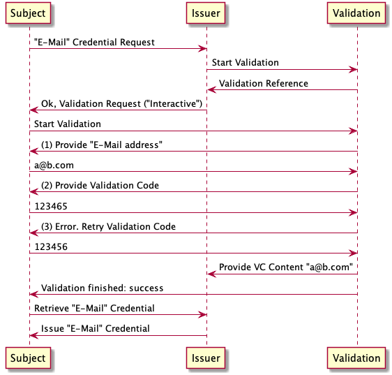

# Analysis of Verifiable Credential Protocols for Issuer Interactions
Martin Riedel, Daniel Kelleher

## Abstract
TODO: Add Abstract

## Introduction
The Verifiable Credential (VC) Standard describes an data model consisting of a Credential Identifier, Claims, Metadata and Signature / Proof section. VC can be issued by an Issuer to an Subject, that can hold onto them for a specific timeframe ("Holder"). A Holder of a Credential is able to present those to a verifier that is able to verify the authenticity of the presented information independently. 

```plantuml
@startuml
actor Issuer as iss
actor Holder as hol
actor Verifier as ver
iss -right-> hol : "issue credential"
hol -right-> ver : "send presentation"
@enduml
```

*Traditional role and imformation flow directions in Verifiable Credential Model*

Functionally, the process of presenting a defined Verifiable Credential to a Verifier is often not initialized by the Holder of the Credential, but rather requested by the verifier to fulfill a specific need. Therefore, the process is often triggered by a Verifier requesting a specific Credential (therefore in the Civic Ecosystem they are called Requesters) and Holder of a matching Credential to present the result back to the verifier. In the community several request implementation exists, but they can generally referred to as a "Presentation Request".

A related requirement exists for the interaction of VC Subject and Issuer for finding Credential Offerings, requesting a Verifiable Credential and providing the required evidence within a Validation Protocol. This paper contribution on the interaction of Subject and Issuer.

```plantuml
@startuml
actor Issuer as iss
actor Subject as hol
actor Verifier as ver
ver -left-> hol : "(1) request presentation"
hol -left-> iss : "(2) request credential"
iss -> hol : "(3) request validation"
@enduml
```

*Inverted Credential Model. Presentation Request, Credential Request and optional (interactive) Validation Protocol. Note that in this model "Holder" is presented as "Subject" since it is the responsibility of the Subject to execute the Validation for the credential.*

## Status Quo

- [DIF Credential Manifest](https://github.com/decentralized-identity/credential-manifest/blob/master/explainer.md)
- [Identity.com](https://github.com/identity-com) Marketplace, Credential Request and Validation Process
- [Others](https://hackmd.io/IQEvSFv2QhqSzWv8ajwicA?both) 

## Subject-Issuer Interaction Analysis

1. *Discovery*: Subject and Issuer must be able to discover each other. Several Scenarios could exists here. Marketplaces, centralized registries, in-person peer-to-peer interactions.

---
2. *Credential Manifest* (non-interactive):
Provides interested `subjects` with information about the issuers capabilities. These include:
- Metadata about the Issuer
- Metadata about the Verifiable Credential
- Protocol Prerequisites

---
3. *Presentation Request* (non-interactive): The issuer can act as a `verifier` in the relationship in order to request `Verifiable Presentations` in accordance to the `verifier-holder` interaction. These presentations can be sufficient in order to 

---
4. *Validation Request (Protocol)* (interactive):
It's the responsibility of the issuer to collect enough information from the subject in order to be convinced to issue a specific credential. The information and overall process may be subject to regulation.

---
5. *External Validation* (non-interactive)

Example 1: Come to the DMV and present `Credential Request Identifier` and other information in person.

Example 2: An external (technical) service is responsible of executing the validation. The issuer passes an `processId` to the external service in order to allow it to map the result back to the original Verification Request. 

## Example Interactive Validation Use Case
```plantuml
@startuml
participant Subject
participant Issuer
participant Validation as IssuerV
Subject -> Issuer : "E-Mail" Credential Request
Issuer -> IssuerV : Start Validation
Issuer <- IssuerV : Validation Reference
Subject <- Issuer : Ok, Validation Request ("Interactive")

Subject -> IssuerV : Start Validation
Subject <- IssuerV : (1) Provide "E-Mail address"
Subject -> IssuerV : a@b.com
Subject <- IssuerV : (2) Provide Validation Code
Subject -> IssuerV : 123465
Subject <- IssuerV : (3) Error. Retry Validation Code
Subject -> IssuerV : 123456

Issuer <- IssuerV : Provide VC Content "a@b.com"

Subject <- IssuerV : Validation finished: success


Subject -> Issuer : Retrieve "E-Mail" Credential
Subject <- Issuer : Issue "E-Mail" Credential

@enduml
```

*Example of an Interactive Validation Process*

## Proposed Protocol Separation:
Independent from the actional protocol implementations we suggest the following seperation of Protocols in Issuer <> Subject/Holder Interaction.

1. Discovery Protocols.
2. Non-Interactive Credential Manifest + Presentation Request Protocol *
3. Interactive Validation Protocols (interal or external)
4. Credential Status Protocols (e.g. request Revocation) *

* *(directly relate to W3C Verifiable Credential Standard)*

## Discussion

